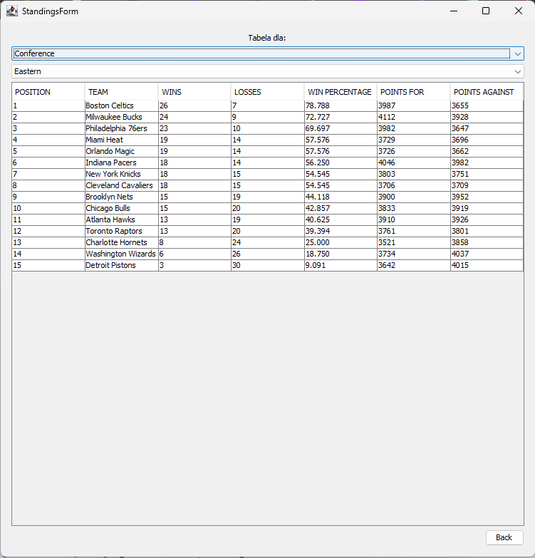

# NBA_DATABASE_PROJECT FOR AGH BAZY DANYCH 1

## Instalacja
TODO

## Interfejs Gościa
Po włączeniu aplikacji wyświetla się okno główne gościa wygląda ono następująco:

Z tego poziomu możemy, lecz nie musimy się zalogować (bądź zarejestrować). Możemy również przejść do jednej z 4 opcji:
- Mecze
- Ligowi Liderzy
- Wykres
- Tabele

Wymienione opcje będą opisane niżej.

## Okno Logowania
Po naciśnięciu przycisku Zaloguj Się otworzy nam się okno Logowania:

Na samej górze okna mamy przycisk umożliwiający rejestrację do systemu, która będzie opisywana niżej.
Następnie mamy dwa pola tekstowe:
- Login
- Hasło
Z czego hasło jest polem tekstowym ukrytym (zamiast tekstu widać gwiazdki).
Po kliknięciu przycisku zaloguj następuję w

## Interfejs Użytkownika

Po zalogowaniu do systemu widzimy że jesteśmy zalogowani jako: login (Logged in as: login). Z tej pozycji możemy się wylogować naciskając przycisk Wyloguj się. Po nacisnięciu tego przycisku spowrotem wyświetla się Okno Gościa.
W Interfejsie Użytkownika widnieją te same opcje, które widniały w Interfejsie Gościa.

## Interfejs Admina

Po zalogowaniu do systemu jako admin - (Trzeba przypisać manualnie z pozycji bazy danych), widzimy prakycznie to samo co przy zalogowaniu jako użytkownik, chociaż widac że jesteśmy adminem, oraz dostępna jest jeszcze jedna dodatkowa opcja:
- Dodaj mecze
Opcja ta również będzie opisana niżej.

## Okno Rejestracji

W oknie rejestracji możemy znaleźć przycisk Logowania oraz trzy pola tekstowe:
- Login
- Hasło
- Powtórz Hasło
Hasło oraz Powtórz Hasło są polami tekstowymi ukrytymi.
Po nacisnięciu przycisku Zarejestruj się następuje utworzenie nowego użytkowanika (jeśli login jest unikalny).

# Funkcjonalności

## Okno Mecze

Po otworzeniu okna mecze z dowolnego poziomu użytkownika (Gość, Użytkownik, Admin) widzimy trzy listy rozwijane:
- Dzień
- Miesiąc
- Rok
Które służą do wybrania daty dnia, z którego chcemy wyświetlić mecze.
Po naciśnięciu przycisku Szukaj, otrzymujemy listę meczów na dany dzień (Drużyny, oraz wyniki meczów). Możemy nacisnąć na dowolny z meczów aby wejść do Okna Box Score danego meczu.

## Okno Box Score

W oknie Box Score dla danego meczu widzimy drużyny oraz wynik meczu, a poniżej dwa przyciski odpowiadające drużynom biorącym udział w meczu.
Naciśnięcie jednego z nich powoduje wyswietlenie tabeli wynikowej dla tej drużyny (tzw. box score).
Domyślnie wyświetlana jest tabela wynikowa dla drużyny gospodarzy.
Aby powrócić do oka mecze musimy zwyczajnie wyłączyć okno box score.

## Okno Ligowi Liderzy

W tym oknie widzimy dwie rozwijane listy odpowiadające za sortowanie:
- Atrybut (statystyka)
- Kolejność (Ascending, Descending)
Oraz Tabele zawierającą informacje na temat statystyk sezonowych zawodników posortowaną względem wspomnainych list.

## Okno Wykresy

W oknie Wykresy możemy wygenerować wykres punktowy zależności dwóch różnych statystyk dla wszystkich zawodników ligi na przykład tak wyglądałby wykres Punktów od Prób rzutów osobistych (baza zaktualizowana na 01.01.2024):

Wykres możemy wygenerować dla zawodników, bądź dla drużyn, wyboru tego dokonujemy w liście rozwijanej na górze okna. Wybieramy również statystyki dla osi X oraz Y.
Poniżej znajdują się rozwinięcia skrótów używanych do opisu statystyk:
- pts - Punkty
- ast - Asysty
- trb - Zbiórki
- stl - Przechwyty
- mp - rozegrane minuty (aktualnie nie działa)
- pf - faule
- fg - trafione rzuty
- fga - oddane rzuty
- fg_pct - procent trafionych rzutów
- fg3 - trafione rzuty za 3 punkty
- fg3a - oddane rzuty za 3 punkty
- fg3_pct - procent trafionych rzutów za 3 punkty
- ft - trafione rzuty osobiste
- fta - oddane rzuty osobiste
- ft_pct - procent trafionych rzutów osobistych
- orb - zbiórki ofensywne
- drb - zbiórki defensywne
- tov - straty
- plus_minus - różnica wyniku podczas pobytu na parkiecie
- blk - bloki
- ts_pct - procent oddanych rzutów biorący pod uwage wage rzutu (rzut za 3 ma wyższą wagę niż rzut za 2)
- 2p - trafione rzuty za 2 punkty
- 2pa - oddane rzuty za 2 punkty
- 2p_pct - procent trafionych rzutów za 2 punkty
- efg_pct - effective field goal percentage*
Przycisk Generuj powoduje generacje wykresu w przeglądarce.

## Okno Tabele

W oknie Tabele widzimy Tabelę ligową oraz dwie listy rozwijane, które decydują o zawartości tabeli, mianowicie, w pierwszej liście wybieramy jaki rodzaj tabeli ma być wyświetlany (League - cała liga, Conference - konferencja, Division - dywizja), w drugiej liście wybieramy, dla której dokładnie części ligi chcemy wyświetlić tabelę.

## Okno Dodaj Mecze

W tym oknie dostępnym tylko dla użytkowników z rolą Admin możemy dodawać mecze do bazy danych na 3 różne sposoby, korzystając z osobiście napisanych skryptów scrape'ujących dane ze strony [Basketball Reference](https://www.basketball-reference.com/):
1. Dodawanie meczu poprzez link do meczu na stronie https://www.basketball-reference.com/ np. https://www.basketball-reference.com/boxscores/202401100ATL.html, ewentualnie można podać samo ID meczu, czyli w tym przypadku 202401100ATL. Jeżeli podamy tekst niezgodny z tymi zasadami przycisk Dodaj pozostanie zablokowany.
2. Dodawanie wszystkich meczów z dnia - dzień wybieramy poprzez listy rozwijane (dzień, miesiąc, rok).
3. Dodawanie całego tygodnia meczów - wybierając tydzień spośród listy rozwijanej.

## Przycisk Wróć
W każdym oknie (poza box score) widnieje przycisk wróć, który kieruję nas spowrotem do Głównego Interfejsu. 
